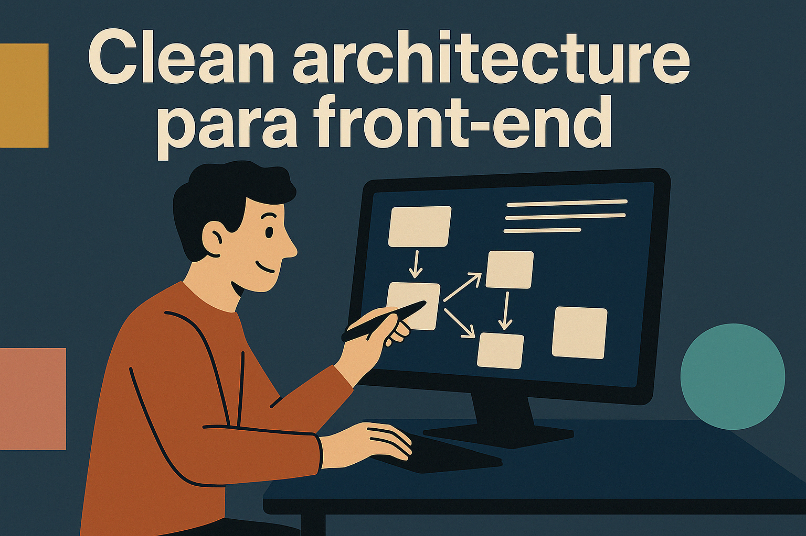
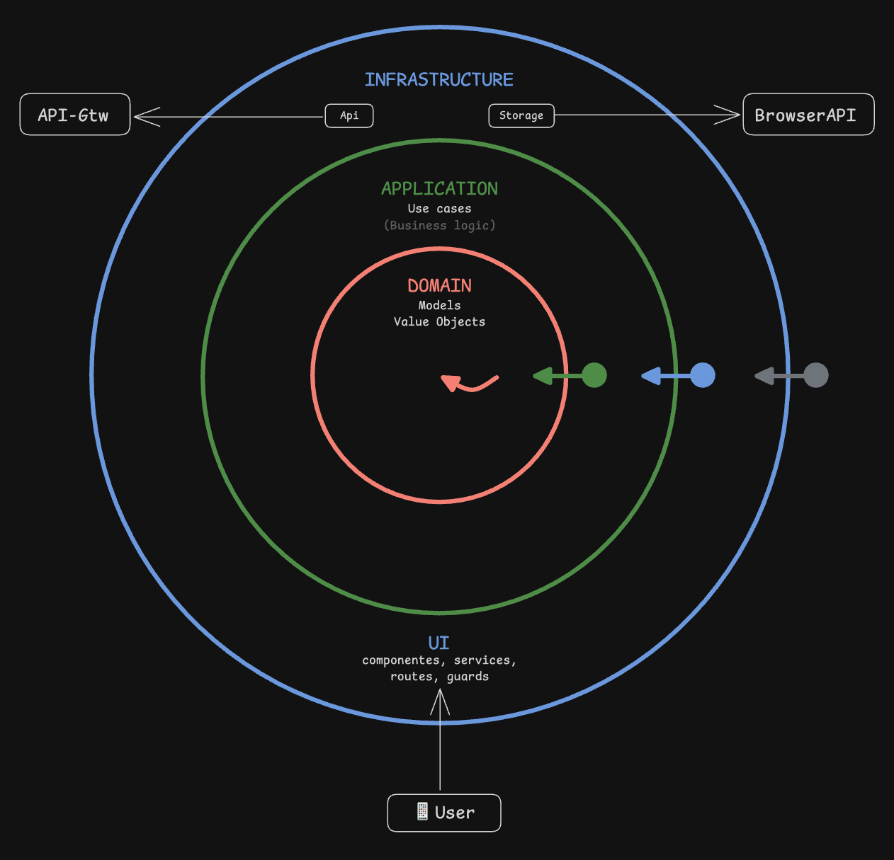
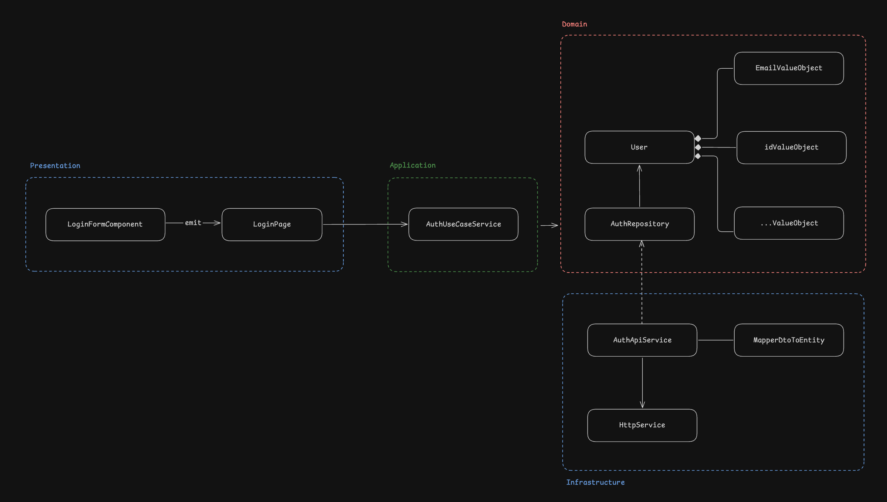
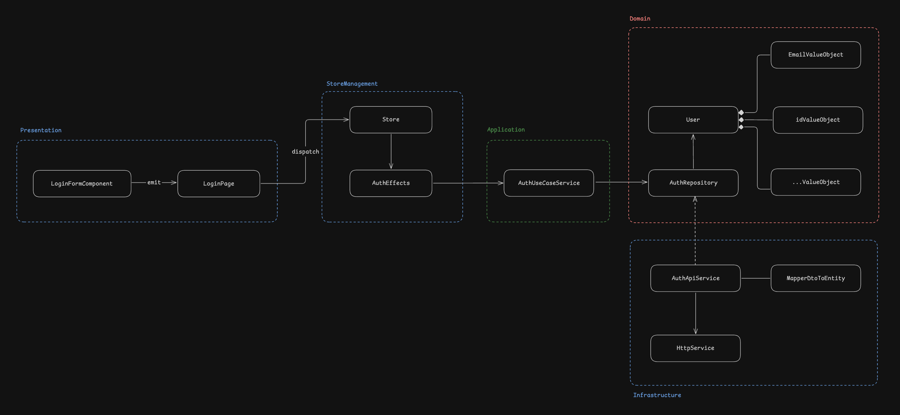

# Un enfoque pragmático inspirado en Clean Architecture

Este documento describe la estructura arquitectónica adoptada en este proyecto, basada en los principios de Clean Architecture pero adaptada para ser más ligera y pragmática, especialmente adecuada para el desarrollo frontend modularizado por features.

## Objetivos

- **Separación de responsabilidades (SoC):** Aislar las distintas partes de la aplicación (UI, lógica de negocio, acceso a datos) para mejorar la mantenibilidad y testeabilidad.
- **Independencia del framework:** Aunque usamos un framework específico (Angular), la lógica central del negocio debe ser lo más independiente posible de él.
- **Testeabilidad:** Facilitar la escritura de pruebas unitarias y de integración para las diferentes capas.
- **Escalabilidad y mantenibilidad:** Permitir que la aplicación crezca de forma ordenada y que los cambios en una parte afecten mínimamente a otras.
- **Claridad:** Que cualquier desarrollador pueda entender rápidamente cómo está organizada la aplicación y dónde debe colocar nuevo código.

## Estructura por módulos (Features)

La aplicación se organiza principalmente en módulos que representan funcionalidades específicas (features). Cada módulo sigue una estructura interna consistente, inspirada en las capas de Clean Architecture. Tomemos como ejemplo un módulo `auth`:

```
src/app/features/
├── auth/
│   ├── ui/
│   │   ├── components/           # Componentes UI reutilizables (Dumb)
│   │   ├── pages/                # Vistas / Componentes contenedores (Smart)
│   │   └── auth.routes.ts        # Configuración de rutas del módulo
│   ├── infrastructure/           # Adaptadores a APIs externas, almacenamiento, validación DTOs, etc.
│   │   ├── dtos/                 # Data Transfer Objects (contratos API) + Schemas Zod
│   │   ├── mappers/              # Transformadores entre capas (DTO <-> Modelo)
│   │   └── auth-api.service.ts   # Implementación de repository/adaptador + validación
│   ├── application/              # Orquestadores de lógica de aplicación (casos de uso)
│   │   └── use-cases/            # Casos de uso específicos
│   ├── models/                   # Entidades de dominio y tipos de datos
│   └── state/                    # Estados propios del módulo
│
├── another-feature/
│   ├── ... (estructura similar)
│
└── ...
```

## Las capas dentro de un módulo

Dentro de cada módulo de feature, encontramos las siguientes capas conceptuales:

1.  **Capa de presentación (UI Layer):**

    - **Responsabilidad:** Mostrar la información al usuario y capturar sus interacciones. Debe ser lo más "tonta" posible, delegando la lógica compleja.
    - **Directorios:** `ui/pages/`, `ui/components/`
    - **Contenido:**
      - `pages/`: Componentes contenedores o "inteligentes". Orquestan la vista, obtienen datos a través de los casos de uso y los pasan a los `components`. Manejan el estado específico de la vista.
      - `components/`: Componentes reutilizables y "tontos". Reciben datos a través de inputs (`@Input()` en Angular, `props` en React/Vue) y emiten eventos a través de outputs (`@Output()` / callbacks). No dependen de servicios ni lógica de negocio.
    - **Dependencias:** Puede depender de casos de uso (`application`) y `models`. **NUNCA** debe depender directamente de `dtos` o `mappers`.

2.  **Capa de aplicación (Application Layer):**

    - **Responsabilidad:** Orquestar los casos de uso de la aplicación. Contiene la lógica que no es puramente de UI ni puramente de dominio. Coordina la obtención de datos, la validación de entradas (que no sea puramente de UI o de contrato externo) y la ejecución de acciones.
    - **Directorios:** `application/`
    - **Contenido:** Clases de servicio que exponen métodos para realizar acciones específicas (ej: `login()`, `getUserProfile()`). Utilizan `models` internamente e interactúan con la infraestructura a través de interfaces/abstracciones. Pueden llamar a otros casos de uso.
    - **Dependencias:** Puede depender de `models` y abstracciones de infraestructura. **NUNCA** debe depender de `ui`, `dtos` o `mappers` concretos.

3.  **Capa de dominio (Domain Layer):**

    - **Responsabilidad:** Contener las entidades y reglas de negocio centrales de la aplicación, independientes de cualquier tecnología o detalle de implementación externo. Es el corazón de la aplicación.
    - **Directorio:** `models/`
    - **Contenido:** Interfaces o clases que representan los conceptos fundamentales del negocio (ej: `AuthUser`, `LoginCredentials`). Define la estructura y tipos de datos del dominio. Las validaciones intrínsecas de estos modelos (que no dependen del formato externo) pueden residir aquí o ser manejadas por la capa de aplicación.
    - **Dependencias:** **NO DEBE TENER DEPENDENCIAS** de ninguna otra capa del módulo (`ui`, `application`, `infrastructure`) ni de frameworks externos. Es la capa más interna y estable.

4.  **Capa de infraestructura/adaptadores (Infrastructure/Adapters Layer):**
    - **Responsabilidad:** Actuar como puente entre la aplicación y el mundo exterior (APIs, LocalStorage, etc.). Implementa las interfaces definidas por la capa de aplicación. Adapta los datos externos al formato interno y viceversa. Realiza la validación de los datos externos (DTOs) antes de que ingresen a la aplicación.
    - **Directorios:** `infrastructure/`, `infrastructure/dtos/`, `infrastructure/mappers/`
    - **Contenido:**
      - `infrastructure/`: Servicios que implementan las interfaces de acceso a datos o servicios externos (ej: `AuthApiRepositoryImpl implements AuthApiRepository`). Aquí se gestiona la comunicación con APIs, almacenamiento, etc. **Es responsable de validar los DTOs entrantes usando Zod, especialmente para datos críticos**, asegurando que los datos que llegan a la capa de aplicación cumplen con el contrato esperado (ej: validar que un monto sea numérico antes de mapearlo).
      - `dtos/`: (Data Transfer Objects) Interfaces o clases que definen la estructura de los datos tal como se envían o reciben de las APIs. Incluyen los **schemas de Zod** para definir y validar estos contratos. Son los "contratos" con el exterior.
      - `mappers/`: Funciones o clases responsables de transformar los `DTOs` (ya validados) en modelos de dominio y viceversa. Mantienen el dominio aislado de los detalles de la API.
    - **Dependencias:** Depende de librerías externas (HTTP clients, Zod), usa `dtos` (y sus schemas Zod) y `mappers`. `mappers` dependen de `models` y `dtos`.

## Validación con Zod en Infraestructura

En lugar de usar Value Objects para la validación de datos primitivos, adoptamos **Zod** para la validación de esquemas directamente en la **capa de infraestructura**.

- **¿Dónde?** Principalmente en la implementación del adaptador/repositorio (ej: `auth-api.service.ts`), justo después de recibir datos externos (DTOs) y antes de mapearlos a modelos de dominio.
- **¿Qué?** Se validan los `dtos` utilizando los schemas definidos con Zod (ubicados junto a los DTOs en `infrastructure/dtos/`).
- **¿Por qué?**
  - **Validación Temprana:** Asegura que los datos inválidos provenientes de fuentes externas sean rechazados antes de entrar en la lógica de la aplicación o dominio.
  - **Claridad del Contrato:** Los schemas de Zod documentan y refuerzan la estructura esperada de los datos externos.
  - **Pragmatismo:** Evita la sobrecarga de crear clases Value Object para cada tipo de dato simple.
- **Flexibilidad:** No es obligatorio validar _todos_ los campos de _todos_ los DTOs. Priorizar la validación para **datos críticos** (aquellos cuya invalidez podría causar errores graves, como IDs, montos financieros, datos sensibles) o cuando la estructura es compleja. Para datos no críticos (ej: descripciones opcionales), la validación puede ser más laxa si se considera apropiado para evitar sobreingeniería, aunque la recomendación general es validar la estructura básica.

#### Ejemplo validación completa de la respuesta

```typescript
import { z } from 'zod';

export const LoginResponseDtoSchema = z.object({
  id: z.string(),
  name: z.string(),
  email: z.string().email(),
  token: z.string(),
});

export type LoginResponseDto = z.infer<typeof LoginResponseDtoSchema>;
```

#### Ejemplo validación más light (únicamente atributos clave)

```typescript
import { z } from 'zod';

export const LoginResponseDtoSchema = z.object({
  id: z.string(),
  token: z.string(),
});

export type LoginResponseDto = z.infer<typeof LoginResponseDtoSchema> & {
  name: string;
  email: string;
};
```

En este ejemplo, los campos `id` y `token` se consideran críticos y esenciales para el funcionamiento de la aplicación, por lo que se validan estrictamente mediante el schema de Zod. Por otro lado, los campos `name` y `email` se tratan como datos no críticos que, aunque son parte de la respuesta, no comprometen la integridad o seguridad de la aplicación si llegaran a faltar o ser nulos. Esta distinción nos permite implementar una validación selectiva, enfocándonos en asegurar la presencia y validez de los datos verdaderamente importantes.

### ¿Por qué esta decisión de validar en infraestructura y no implementar ValueObjects?

Esta decisión representa una desviación consciente de los principios puros de Clean Architecture, donde las validaciones del dominio deberían residir en la capa de dominio, típicamente implementadas a través de Value Objects. Sin embargo, hemos optado por este enfoque por varias razones prácticas:

1. **Pragmatismo vs Purismo**: Si bien las validaciones son parte de las reglas del dominio, la implementación a través de Value Objects para cada atributo puede resultar en un código más verboso y complejo de mantener. Zod nos permite expresar estas validaciones de manera más concisa y declarativa.

2. **Eficiencia en el desarrollo**: Al validar en la capa de infraestructura usando Zod:

   - Reducimos la cantidad de código boilerplate
   - Aprovechamos el sistema de tipos de TypeScript de manera más efectiva
   - Simplificamos el proceso de validación sin sacrificar la seguridad

3. **Protección temprana**: Al validar en el punto de entrada de los datos externos, garantizamos que solo datos válidos lleguen a nuestro dominio. Esto actúa como una primera línea de defensa, previniendo que datos malformados contaminen nuestra lógica de negocio.

4. **Flexibilidad y mantenibilidad**: Este enfoque nos permite ajustar fácilmente las validaciones según las necesidades, manteniendo un equilibrio entre rigurosidad y practicidad.

Es importante notar que esta decisión no implica abandonar completamente las validaciones en el dominio. Las reglas de negocio complejas o que involucren múltiples atributos siguen residiendo en la capa de dominio. Lo que hemos hecho es mover las validaciones más básicas y estructurales a la capa de infraestructura, donde Zod puede manejarlas eficientemente.

Esta aproximación representa un compromiso pragmático entre la pureza arquitectónica y la eficiencia en el desarrollo, priorizando la mantenibilidad y la velocidad de desarrollo sin comprometer la integridad del sistema.

## La Regla de Dependencia

La regla más importante para mantener la arquitectura limpia es:

**Las dependencias sólo pueden apuntar hacia adentro.**



## Flujo Típico (Ejemplo: Login)

Esta regla de dependencia establece que las capas externas pueden depender de las capas internas, pero nunca al revés. Es decir:

- La capa de UI/Presentación puede depender de Application
- Application puede depender de Domain
- Pero Domain no puede depender de Application ni UI
- Y Application no puede depender de UI

Esto asegura que:

1. Las capas internas permanezcan aisladas y reutilizables
2. Los cambios en capas externas no afecten a las internas
3. El dominio se mantenga puro y libre de detalles técnicos
4. Se pueda reemplazar la UI o infraestructura sin modificar la lógica core

Veamos un ejemplo práctico con el flujo de `Login`, donde exploraremos dos aproximaciones diferentes:

1. Una implementación sin manejador de estados, donde el flujo es más directo
2. Una implementación utilizando un store para el manejo del estado, agregando una capa adicional de gestión de datos

#### Sin Store de Estado



#### Con Store de Estado



## Beneficios de este Enfoque

- **Claridad:** Es relativamente fácil entender dónde encontrar o añadir código.
- **Mantenibilidad:** Los cambios en la UI tienen menos probabilidad de romper la lógica de negocio, y viceversa. Cambiar una librería externa (ej: cliente HTTP, formato API) debería afectar principalmente a la capa de infraestructura.
- **Testeabilidad:**
  - Los `models` se pueden probar aisladamente.
  - Los casos de uso (`application`) se pueden probar haciendo mock de las interfaces de infraestructura.
  - La `infrastructure` se puede probar haciendo mock de las llamadas HTTP/externas y verificando la validación Zod y el mapeo.
  - Los `components` (dumb) se pueden probar fácilmente pasando props.
  - Los `pages` (smart) requieren mocks de los casos de uso (`application`).
- **Reutilización:** Los `models` y potencialmente algunos casos de uso (`application`) pueden ser reutilizados si se mueven a capas compartidas (`core/`, `shared/`).

## ¿Cuándo desviarse (con precaución)?

Aunque la arquitectura limpia proporciona una estructura sólida, hay situaciones donde se puede flexibilizar con precaución:

1. **Acceso Directo a Infraestructura desde UI**

   - Para operaciones muy simples (ej: obtener una lista simple sin transformación)
   - Cuando el overhead de crear toda la estructura no justifica el beneficio
   - **PERO**: Documenta estas excepciones y mantenlas aisladas

2. **DTOs compartidos entre capas**

   - En proyectos pequeños donde el costo de mantener mappers separados supera el beneficio
   - Cuando hay garantía de que la estructura externa no cambiará
   - **PERO**: Considera el impacto a largo plazo y la pérdida de flexibilidad

3. **Lógica de UI en componentes smart**

   - Para prototipos rápidos o MVPs
   - Cuando la separación añadiría complejidad innecesaria
   - **PERO**: Plan para refactorizar si el componente crece en complejidad

4. **Dependencias directas en tests**
   - Tests de integración que atraviesan múltiples capas
   - Cuando mockear toda la cadena es más complejo que usar implementaciones reales
   - **PERO**: Mantén la mayoría de los tests respetando los límites de la arquitectura

**IMPORTANTE: Estas desviaciones deben ser:**

- Excepcionales y justificadas
- Documentadas explícitamente
- Contenidas en alcance
- Evaluadas en términos de riesgo vs beneficio
- Consensuadas con el equipo

Este enfoque busca un equilibrio práctico, obteniendo muchos beneficios de Clean Architecture sin una complejidad excesiva. La clave es la **consistencia** y el respeto a la **regla de dependencia**.

## FAQs

**¿Qué estrategias puedo usar para mantener la arquitectura a medida que el proyecto crece?**

- Revisiones de código enfocadas en la arquitectura: Asegúrate de que los pull requests sean revisados también desde la perspectiva de la arquitectura, verificando que se sigan los principios y se mantenga la separación de responsabilidades.
- Diagramas de arquitectura: Mantén un diagrama de alto nivel de la arquitectura para que todos los miembros del equipo tengan una visión clara de las capas y sus dependencias.
- Refactorización continua: A medida que el proyecto evoluciona, inevitablemente surgirán áreas donde la arquitectura podría mejorarse. Dedica tiempo a refactorizar el código para mantenerlo limpio y adherido a los principios.

**¿Cómo comparto lógica o utilidades comunes entre diferentes capas o features?**

- En el folder `core/` o `shared/` puede albergar código reutilizable que no pertenezca a una feature específica. Esto puede incluir:
  - Modelos de dominio comunes.
  - Interfaces o tipos base compartidos.
  - Funciones de utilidad puras (ej: formateo de fechas, cálculos genéricos).
  - ¡Cuidado con las dependencias! El código en `core/` o `shared/` no debe depender de capas específicas de las features (`ui`, `application`, `infrastructure`).

**¿Por qué usar mappers en la capa de infraestructura?**

- El servicio de infraestructura recibe un DTO (estructura de datos externa) y lo transforma a un modelo de dominio usando el mapper.
- El caso de uso (application layer) recibe ya el modelo de dominio, y nunca tiene que preocuparse por detalles de la API ni por la estructura del DTO.
  - ¿Por qué consideramos correcto este enfoque?
    - Responsabilidad única: La infraestructura se encarga de adaptar los datos externos (DTOs) al formato interno (modelo de dominio). El caso de uso solo orquesta lógica de negocio, sin saber nada de formatos externos.
    - Aislamiento: Si mañana cambia el backend o el DTO, solo modificas el schema Zod, el mapper y/o la infraestructura. ¡El dominio y los casos de uso no cambian!
    - Testabilidad: Puedes testear el caso de uso con modelos de dominio puros, sin preocuparte por mocks de DTOs o validaciones externas.

**¿Puedo saltarme los mappers si el DTO y el modelo son iguales?**

- No es recomendable. Tener un mapper explícito te da flexibilidad para cambios futuros y mantiene el dominio protegido de cambios en la API externa.

**¿Dónde pongo la lógica de validación de negocio?**

- **Validación de Contratos Externos (Formato/Tipo):** En la capa de **Infraestructura**, usando **Zod** sobre los DTOs recibidos, antes del mapeo. Esto asegura que los datos externos cumplen la estructura esperada (ej: `amount` es `number`).
- **Reglas de negocio (Condiciones/Estado):** Principalmente en la capa de **Aplicación (Casos de Uso)**. Aquí se verifica si una acción es permitida según el estado actual o reglas complejas que involucran múltiples entidades o datos (ej: verificar si el saldo es suficiente antes de una transacción, si un usuario está activo para loguearse).
- **Invariantes del dominio (consistencia interna):** Pueden existir algunas validaciones simples directamente en los **Modelos de Dominio** si representan reglas fundamentales e intrínsecas del objeto que siempre deben cumplirse, independientemente del caso de uso (ej: un `Order` siempre debe tener al menos un `OrderItem`). Sin embargo, evitar lógica compleja aquí.

**¿Cómo testeo cada capa?**

- **Dominio (`models`):** Tests unitarios puros, verificando tipos y quizás alguna lógica interna simple si existe.
- **Aplicación (`application`):** Tests unitarios, usando mocks para las interfaces de infraestructura. Verificar la orquestación y las reglas de negocio.
- **Infraestructura (`infrastructure`):**
  - Tests unitarios para los `mappers`.
  - Tests unitarios para la lógica de validación Zod (puedes probar los schemas).
  - Tests de integración para los adaptadores/repositorios, idealmente contra un entorno de pruebas o mocks de APIs, verificando la comunicación y la validación/mapeo de extremo a extremo.
- **UI (`ui`):** Tests de componentes (dumb) y tests de páginas/contenedores (smart) usando mocks de los casos de uso.

**¿Cómo evito dependencias circulares entre features?**

- Nunca hagas que un caso de uso de un feature dependa directamente de otro feature. Si necesitas lógica compartida, muévela a una capa común (`core/`, `shared/`).

**¿Qué hago si tengo dudas sobre dónde poner algo?**

- Pregunta al equipo o revisa este documento. Si sigue sin estar claro, prioriza la separación de responsabilidades y la independencia del dominio. Es mejor errar por exceso de claridad que por acoplamiento.

**¿Puedo evitar la interfaz para la capa de infraestructura?**

- No es recomendable si buscas mantener un buen desacoplamiento. La interfaz (definida o usada por la capa de Aplicación) permite que la aplicación dependa de una abstracción, haciendo más fácil sustituir o probar la implementación de infraestructura. Saltarla acopla directamente la aplicación a los detalles de la infraestructura.

## Glosario de Términos Clave

- **Feature (Módulo):** Unidad funcional independiente de la app, agrupada por dominio o responsabilidad (ej: auth, users, orders).
- **DTO (Data Transfer Object):** Objeto que representa la estructura de datos tal como se recibe de APIs externas. No contiene lógica de negocio.
- **Modelo de Dominio:** Representa conceptos centrales del negocio en la app. Es independiente de detalles externos y puede contener lógica relevante.
- **Entidad:** Objeto de dominio con identidad propia y vida larga (ej: User, Transaction).
- **Caso de Uso (Use Case):** Orquestador de lógica de aplicación (en `application/use-cases/`). Expone acciones del sistema y coordina modelos, interfaces de infraestructura y reglas de negocio.
- **Servicio de Infraestructura / Adaptador:** Clase (en `infrastructure/`) que implementa una interfaz definida en la aplicación y interactúa con el mundo externo (APIs, storage, etc.). Valida DTOs con Zod y adapta datos externos a modelos internos usando mappers.
- **Mapper:** Función o clase (en `infrastructure/mappers/`) que transforma datos entre DTOs (ya validados) y modelos de dominio (y viceversa).
- **Schema Zod:** Definición de la estructura y reglas de validación para un DTO, utilizada en la capa de infraestructura para validar datos externos.
- **Regla de Dependencia:** Principio que indica que las dependencias siempre deben apuntar hacia el dominio, nunca al revés.
- **Infraestructura:** Todo lo que conecta la app con el mundo externo (APIs, storage, etc).
- **Dominio:** Núcleo de la lógica y reglas de negocio de la app, independiente de frameworks y detalles externos.
- **Test Unitario:** Prueba que verifica el comportamiento de una unidad aislada (función, clase, método) sin dependencias externas.
- **Test de Integración:** Prueba que verifica la interacción entre varias partes del sistema y/o con servicios externos.
